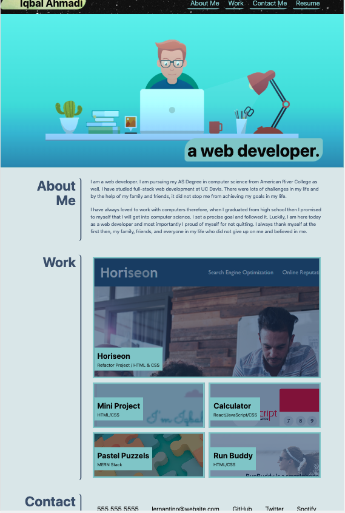

# Lernantino-Portfolio
[Deployed Link Here](https://iqbalahmadi.github.io/Lernantino-Portfolio/)

  

## Description 
This repo provides other developers as well as potential employers with a visual snapshot of my info and projects. 

- HTML was updated to utilize semantic HTML 5
- CSS was consolidated and modified to reflect proper utilization
- Alt attributes were added to img tags for accesibility
- Heading tags were updated to follow proper order

## Built With

- HTML
- CSS

## Important Note

- The website is created with responsible design
- Special media queries are used to make the website responsible for 980px, 768px, and 575px screens
- "Horiseon Refactor", "Mini Project", "Run Buddy" images are clickable and taking to my other projects (New tab) 
- The phone number and email are created as call-to-action buttons and triggering a phone call and email client opening

## Active Links

- "Resume" is linked to my LinkedIn profile
- "GitHub" is linked to my GitHub profile
- "Twitter" is linked to my Twitter profile
- "Spotify" is linked to Spotify mian page
- "About Me", "Work", "Contact Me" links are scrolling the website to the appropriate sections

## Badges 
https://img.shields.io/github/checks-status/IqbalAhmadi/Lernantino-Portfolio/main?color=g

## Screenshot of the Page

The following image shows the website's current state

  

